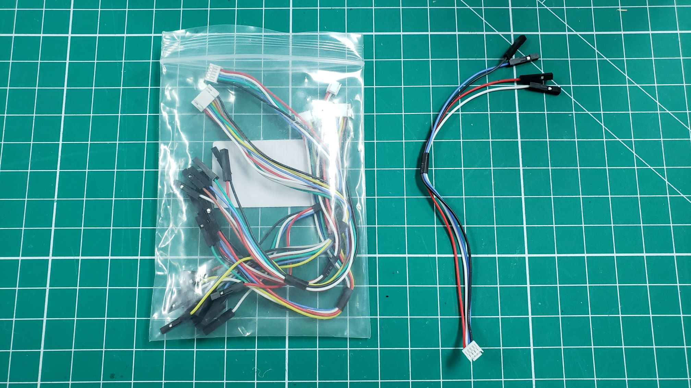
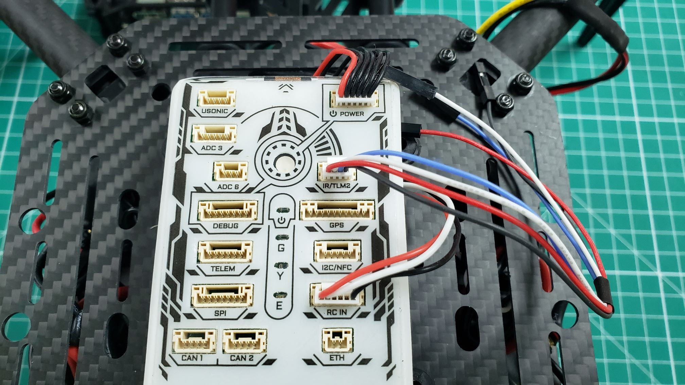
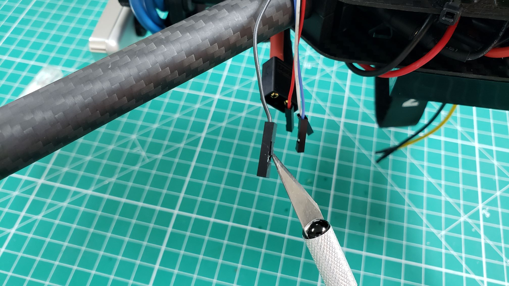
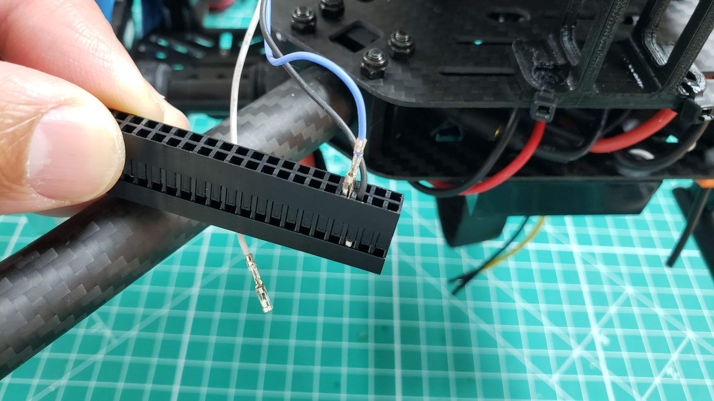

It's important that the FC and VMC can communicate with each other.
This bi-directional communication will allow us to receive telemetry
data from the FC and send data to it from the VMC. If you recall,
before we communicated with the FC using a micro-USB cable connected to a
PC running QGroundControl. What you will be able to do now is communicate over a
WiFi network, which will make this process easier.

In addition to a wireless link between the VRC drone and QGC you will learn
how to configure position hold capabilities using external cameras. You may
have noticed with the basic drone that the drone required constant input from the
pilot to maintain position in **stabilized** flight mode. With the assistance
of these cameras you will be able to hover in **position** mode with ease!
The cable we build in this section makes this all possible.

Locate the cable bundle in **Box 5** and find the cable with a 4 pin
JST-GH connector as seen below. The colors of the wires should
be red, black, blue, and white.

Plug the JST-GH connector into the port labeled **IR/TLM2** as shown in the
photo below. Later on in the configuration process we will load new parameters
from QGC onto the FC, which will enable communication over this port.

At the other end of the cable there are plastic connectors that will be removed.
Each of the connectors has a small tab that can be lifted up using an X-Acto
knife or small blade.

After lifting the plastic tab the connector should easily slide off the wire,
exposing the metal leads. Remove the connectors for the black, blue, and white wires.

Each of these pins will be placed into a 2x20 crimp housing that can be seen below.
There is a bag of several crimp housings located in **Box 5**.
The wires should be placed in the housing so that the plastic tabs lock onto each
of the metal leads as seen below. This will prevent the leads from accidentally
being pulled out. Be sure to zoom in on the photo to see the proper orientation.

It's very important to make sure your wire order matches the photo below.
The blue and white cables are what handle the transmit/receive signals
between the FC and VMC. The black wire goes to ground.

{}
It's a good idea to clip the red lead to keep your build nice and tidy.
We recommend clipping this lead right where it comes out of the heat shrink.
If you look closely at top left of the photo below, you will see where the
red lead has been clipped.
{}

The crimp housing is now complete. This will plug into the header pins on
the VMC in the next section, so don't worry about plugging it in just yet.
It's much easier to mount the VMC and plug this housing in later.
