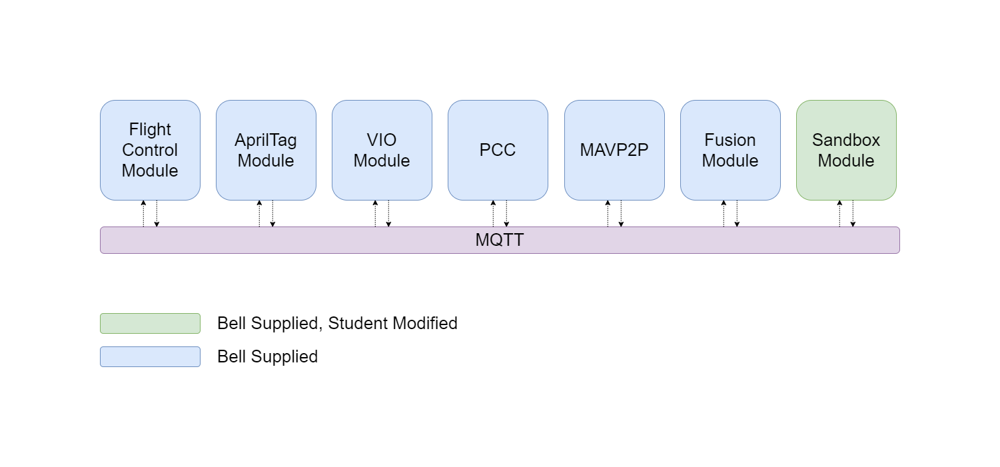

Your team will need to create a sandbox environment to develop from.

In the
[GitHub repository](https://github.com/bellflight/AVR-2022/tree/main/VMC/README.md)
we've provided an area for you to write
Python in order to accomplish your goals. The software stack for AVR is
made up of a series of modules, which are actually independent
[Docker Containers](https://www.docker.com/resources/what-container).

Below is a graphic that shows the individual containers:

All of these modules communicate with each other over a message bus called
[MQTT](http://www.steves-internet-guide.com/mqtt-works/).
You could loosely think of MQTT like a social media feed.
You can **publish** posts and your friends can **subscribe** to your feed to see them.
Similarly, you can subscribe to your friends' feeds and see their posts too.

Below is a non-exhaustive list of the kinds of data some of the modules publish:

- Flight Control Module
  - Drone Position
  - Drone Orientation
  - Drone Velocity
  - Drone Flight Mode
  - Drone Battery Level
- AprilTag Module
  - Visible AprilTag IDs
  - Their relative Positions
- VIO Module
  - T265 Position
  - T265 Velocity
  - T265 Confidence
- PCC Module
  - Actuator States (Coming Soon)
  - LED Halo States (Coming Soon)
- Fusion Module
  - Coordinate Transformed Drone Position

You can read more about these modules [here.]()

Your task here will be to subscribe to the
necessary topics above and write your own logic to produce the
desired output. The following sections will help you:

- Create a github project for your team based on the current AVR codebase
- Develop on the Jetson
- Manage a project with Git
- Containerize your code with Docker
