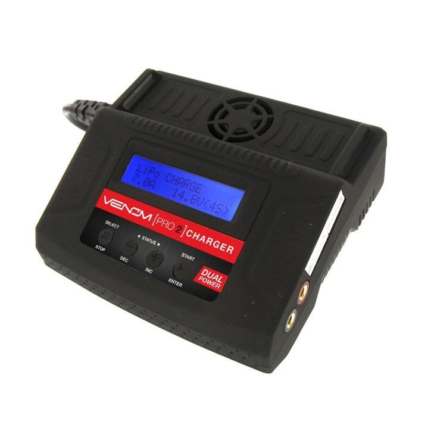
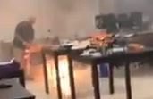
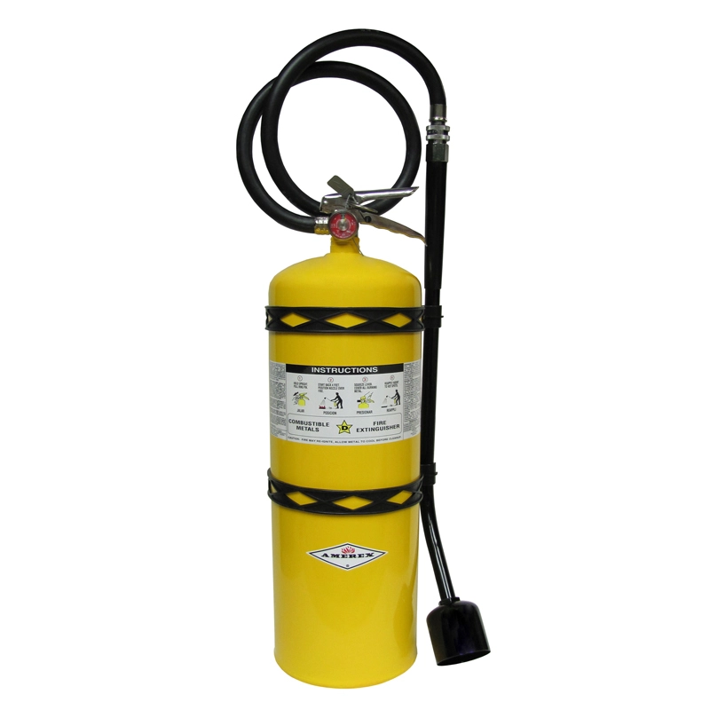
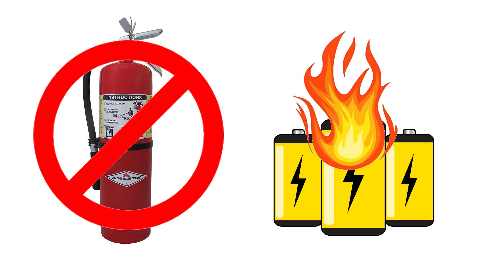
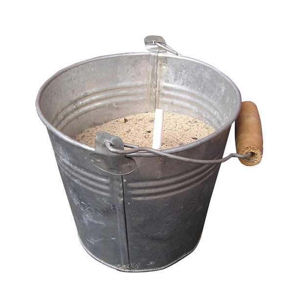

## Safety Overview

**Please ensure all team members have read the LiPO instruction sheet that was
included with the Venom battery as well as the manual for the Venom Pro 2 Charger.**

These documents can be viewed at:

-   [Venom 15027 4S 5000mAh 35C Battery]()
-   [Venom Pro 2 Charger]()

### Key Safety Points

-   Always charge batteries using the proper settings.
    Improper charge settings may result in a catastrophic failure of the battery.
-   Never charge batteries unattended. If, during a charge, you need to leave for
    any reason, stop the charge and disconnect the battery from the charger.
    You can restart charging when you return.
-   If a battery ever becomes warm/hot during charge, or starts to swell, it
    should be removed from the charger and taken outside where it cannot cause
    damage if it fails. If a battery fails as a result of damage or misuse it
    may result in fire.
-   Never leave a battery connected to your device or charger when not in active use.
    This may cause a parasitic draw on the battery which may lead it
    to become over-discharged.

### LiPO Battery Voltage Range

-   4.20V per cell represents a fully charged cell.
-   3.00V per cell is the very lowest the battery can go without sustaining damage.
-   3.70V per cell is the "Nominal Voltage" which is the "named" voltage of the cell.
    This voltage is used as a standard to identify the cell/battery type.
-   3.5-3.7V per cell is the voltage we would recommend landing at.

The battery you will be using is a Venom 14.8V 5000mAh 35C Battery.

### Definitions

-   **Battery**: A battery is a device consisting of one or more electrochemical
    cells with external connections for powering electrical devices.
-   **mAh**: is an abbreviation for milliamp hour and is a unit that measures
    (electric) power over time. It is commonly used to measure the energy capacity
    of a battery. In general, the more mAh and the longer the battery capacity or
    battery "run time."
-   **C-Rating**: is a shorthand representation of how many amps the cells can
    supply on a continuous basis without failing.
-   **Cell Count:** How many cells are in series to make the overall voltage of
    the pack. In this case, 4 cells are in series to make 14.8V nominal, or 16.8V
    when fully charged. Sometimes referred to as a 4S battery, the "S" refers to
    "series" to tell us how many cells are comprising the battery pack.

### The Charger: Venom 0677 (Pro 2)

The Venom Pro 2 is one of Venom’s most popular single-channel
multi-chemistry battery chargers. It features an 80W Power supply
as well as an integrated balancing port. The Pro 2 is capable of
charging 1S-6S batteries.

We recommend you use this pouch as a charging mat,
this will give you an added layer of protection between the battery and
the charging surface. Always remember to charge batteries on a
non-combustible surface.

### The Cell Checker: Venom 0644

This cell checker provides you with instant access to see the voltage of the
individual cells of your battery. It doubles as a low voltage alarm, but you
probably will not use it in that capacity. It will first show the overall pack
voltage, and then cycle through showing the voltage of each individual cell.

{}
When using the cell checker, you need to plug it in with the contacts
(silver tabs) facing up and (black plastic arrows facing down)
and the plug towards the left side of the checker.
{}

## What to Do in Case of Fire

If you you follow the directions and safety guidelines provided above, you
should be perfectly safe. However, in the event that something has gone wrong,
and you have a LiPo fire, here's what you should do in order of priority:

{}
_Please_ read this section, this has happend before!

{}

1. **_First, get yourself and those around you to safety_**. Things are replaceable,
   while you (and your lungs) are not. Battery fires produce very toxic smoke, and
   you do NOT want to breathe it in.
2. Get help. This depends on your specific situation, but this may be to pull a nearby
   fire alarm, call 911, or call your security department.

After doing the above two steps, and _only if you're comfortable with it_ and does
not pose any danger to you, you can attempt to fight the fire. Your most effective
tool is a class D fire extinguisher. These are special fire extinguishers that are
meant to put out combustible metals (such as Lithium) and stand out as
being bright yellow.

**_A normal, red, class ABC fire extinguisher does very little to put out a battery fire._**
Don't waste your time unless you have nothing else to smother the flames with.

However, class D fire extinguishers tend to be uncommon.
_If_ a class D fire extinguisher **is** available, pull the safety pin, aim the nozzle,
and squeeze the handle. These tend to be quite heavy, so you may need an additional
person to assist.

If a class D fire extinguisher is **not** available, your next best bet is to throw
a fire blanket over the fire to smother it as much as possible. This won't put it out,
but it will supress the flames. Most labs have a fire blanket,

Finally, as a last resort, pour sand or dirt on the fire.
This is generally what we have on hand at competition events for safety and acts
similarly to a fire blanket.

